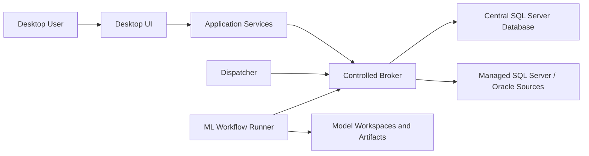
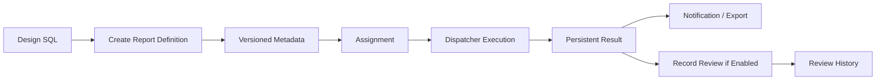
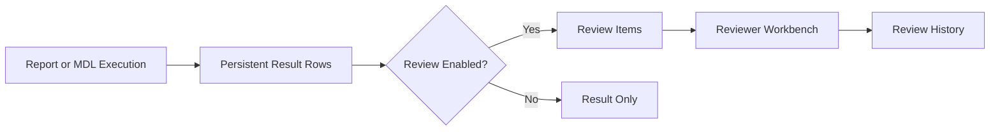
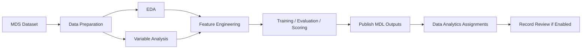

# CAMP Technical Reference

This reference describes the high-level architecture, data domains, security model, execution lifecycle, and traceability design of CAMP. It avoids implementation-level source code details and focuses on the technical operating model.

## 1. Architecture Overview

CAMP follows a layered desktop architecture:

The desktop interface provides user workflows. Application services enforce permissions and business rules. The broker centralizes controlled execution and source access. The dispatcher triggers scheduled workloads. The central database stores metadata, results, logs, and traceability records.

## 2. Main Layers

| Layer | Responsibility |
|---|---|
| UI | Screens, dialogs, forms, grids, canvas views, and user interactions. |
| Service layer | Business rules, permission checks, validation, orchestration, and persistence coordination. |
| Broker | Controlled database access, report execution, export, queues, and privileged operations. |
| Dispatcher | Periodic evaluation and execution of due assignments. |
| Central database | Metadata, operational state, persistent results, review records, logs, tasks, and ML workflow records. |
| Runtime storage | Local operational files, logs, exports, model runtimes, and artifacts. |

## 3. Central Data Domains

CAMP uses central logical domains to separate operational responsibilities.

| Domain | Responsibility |
|---|---|
| Security and identity | Users, roles, permissions, login status, MFA state, source access rules. |
| Reporting metadata | Report catalog, versions, parameters, references, source mode, activation state. |
| Assignment and scheduling | Responsible users, period rules, dispatcher state, notification/export/review flags. |
| Persistent results | Report execution outputs, current result views, and row-level references. |
| Review | Review items, status, risk, explanations, history, and completion records. |
| Team Management | Work years, task portfolio, team membership, status history, summaries, expense records, permissions. |
| ML Workflow | Workflows, canvas nodes, edges, scripts, runs, datasets, artifacts, metrics, model registry, versions. |
| Audit and logging | Activity, session, query, source, export, notification, queue, dispatcher, and error logs. |

## 4. Schema Responsibilities

The central database is organized by schema responsibility.

| Schema | Purpose |
|---|---|
| `ccm` | Core configuration, users, roles, permissions, reports, assignments, dispatcher state, and audit metadata. |
| `rpt` | Persistent report and model result tables and current result views. |
| `dm` | Analytical datamart and derived metrics where used. |
| `scratch` | Controlled temporary or intermediate analytical working area. |
| `rvw` | Record Review state and row-level review history. |
| `tsk` | Team Management portfolio, task, team, history, and expense records. |
| `mdl` | ML workflow canvas, runs, datasets, scripts, artifacts, metrics, and model versions. |

Schema guards are expected to be idempotent so bootstrap and update procedures can safely ensure required objects exist without destroying production data.

## 5. Security Model

Security is based on authenticated users, role membership, action permissions, source access rules, and service-account execution.

Important design points:

- UI visibility is not the only control point.
- Services validate permissions before executing sensitive operations.
- Source visibility can be constrained by role or user.
- Database operations run through the controlled execution layer.
- Secrets are handled through protected storage according to deployment policy.
- Administrative functions are separated from business review ownership.
- Audit records preserve user context and service execution context.

## 6. Authentication and MFA

The product supports enterprise login and optional MFA behavior. MFA may be local authenticator based or integrated with an external enterprise provider depending on deployment.

MFA design should preserve enrollment tracking, recovery process, audit trail, administrative control, and failure logging.

## 7. Report Lifecycle

A governed report follows this lifecycle:

Report definitions are versioned. Executions are linked to the version used at runtime. Result rows can become review items depending on assignment configuration.

## 8. Assignment Lifecycle

Assignments define operational ownership and schedule. They are not merely delivery rules; they determine recurring execution, responsible users, notification/export behavior, and review routing.

For standard reports, assignments are independent. For ML-origin MDL outputs, assignments under the same workflow/model share the model period so the workflow is not triggered multiple times for conflicting output schedules.

## 9. Dispatcher Lifecycle

Dispatcher processing includes:

1. load active assignments,
2. evaluate due period rules,
3. group ML-origin assignments by workflow/model,
4. submit execution through broker/service layer,
5. write execution state,
6. persist result rows,
7. apply notifications and exports,
8. create review items if enabled,
9. update next due state and logs.

Dispatcher behavior should be observable through execution history and logs.

## 10. Self-Service Lifecycle

Self-service reporting separates report logic from user-supplied parameters. Users submit requests, the system validates access and parameters, queues execution, runs the report through the controlled service layer, and records request history.

This allows business users to request approved report outputs without changing SQL or report metadata.

## 11. Record Review Data Flow

Record Review creates row-level work items from persistent execution results when enabled by assignment.

Review records preserve report execution, result row, assigned user, status, risk classification, explanation, timestamps, and completion state.

## 12. Team Management Architecture

Team Management uses a structured domain model for planning and execution governance.

Core entities include work year, plan period, task, task team, task assignment, status history, working summary, extension and suspension requests, expense records, and team permissions.

The module is integrated with the common identity, role, audit, and notification model.

## 13. ML Workflow Architecture

ML Workflow Studio uses a canvas-backed workflow model. The visual nodes and edges represent the actual workflow definition.

The workflow is stored as a directed acyclic graph. Nodes represent MDS dataset execution, Python processing, or publishing. Edges represent dependency order.

## 14. ML Lifecycle

ML workflows have UAT and Prod modes.

| Mode | Technical behavior |
|---|---|
| UAT | Temporary run records, trial artifacts, manual execution, cleanable outputs, publish validation without final operational distribution. |
| Prod | Finalized workflow version, persistent run records, model artifacts, metrics, model registry linkage, MDL publishing, assignment-driven execution. |

A Prod model is created from a successful UAT run. The finalized snapshot preserves workflow structure, scripts, metrics, artifacts, and version context needed for traceability.

## 15. MDS and MDL Relationship

MDS and MDL are distinct report families in the ML operating model.

| Type | Role |
|---|---|
| MDS | Model dataset source. It feeds ML workflows and is not assigned directly. |
| MDL | Model output package. It is assigned, distributed, and optionally routed to Record Review. |

A model can use one or more MDS inputs and publish one or more MDL outputs. MDL outputs from the same model can have different responsible users while sharing the same model execution period.

## 16. Model Runtime and Artifacts

Model runtimes are separated from the core application runtime. This supports model-specific dependencies and reduces risk that model libraries destabilize the desktop platform.

Artifacts are generated run outputs. They may include data profiles, model files, metrics, model cards, scored outputs, and publish contracts. Artifact metadata is cataloged centrally while large files remain in controlled runtime storage.

## 17. Publish Contract Concept

The publish step reads a structured contract produced by the model workflow. The contract describes one or more MDL packages and their rows. Each package becomes or updates an MDL report output in the reporting domain.

The contract is the boundary between model computation and operational reporting. It allows Python code to decide how to segment final results, while CAMP manages cataloging, assignment, scheduling, review routing, and traceability.

## 18. Data Lineage

CAMP preserves lineage across analytical and operational steps:

- source profile,
- report definition,
- report version,
- assignment,
- execution,
- result row,
- review item,
- review action,
- task or operational follow-up where applicable.

For ML workflows, lineage additionally includes workflow/model identity, MDS execution, node run steps, artifacts, metrics, model version, MDL package, MDL assignment, and MDL execution result.

## 19. Audit and Logging

Audit and logs support operational accountability and troubleshooting.

Log categories may include authentication and session events, user activity, report definition changes, assignment changes, query execution, source connection events, dispatcher runs, self-service queue processing, notification delivery, export activity, review actions, task changes, ML workflow runs, and errors.

Logs should be retained according to organizational policy.

## 20. Concurrency and Resilience

The platform should handle recurring workloads, user actions, and queued requests without relying on uncontrolled manual processes.

Key resilience principles:

- idempotent schema guards,
- explicit execution state,
- retryable queue or dispatcher operations where appropriate,
- protected update procedures,
- controlled reset procedures,
- clear separation between definitions and run history,
- model runtime isolation,
- persistent logs for failure analysis.

## 21. Data Retention Considerations

Retention policy should address report definitions and versions, execution history, persistent result rows, review records, task history, audit logs, model artifacts, UAT temporary outputs, Prod model snapshots, exports, and notification history.

UAT ML data can be cleaned according to policy. Prod model evidence should be retained as part of the governed analytical record.

## 22. Integration Boundaries

CAMP integrates with enterprise systems through controlled boundaries:

- SQL Server and Oracle analytical sources,
- SMTP server,
- Windows/domain identity context,
- optional MFA provider,
- file system locations for exports and artifacts,
- scheduler infrastructure.

Integration design should preserve least privilege and auditable execution.

## 23. Product Design Principles

CAMP is based on these enterprise design principles:

- analytical work must be reproducible,
- ownership must be explicit,
- results must be traceable to definitions and versions,
- review work must be connected to source results,
- scheduled execution must be controlled,
- model outputs must be governed like report outputs,
- operational history must survive interface sessions,
- administrative functions must be separated from business review ownership.

## 24. Readiness Controls

A technically ready environment should demonstrate authenticated login, approved user and role matrix, central DB schema readiness, source connectivity, broker operation, dispatcher operation, standard report execution, self-service request execution, assignment-driven recurring execution, review item creation and completion, Team Management save and history behavior, ML UAT execution, ML Prod publishing and MDL assignment behavior, logs, and healthcheck visibility.
